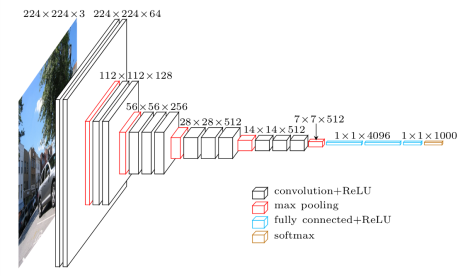

# Singa-Auto Demo - CNN Classification Model

作为演示模型，SaClassDemo模型可以应用于简单的图像分类任务。

As a demo model, SaClassDemo can be applied to simple image classification task. 

## 数据预处理 Dataset preparation
对于数据的预处理，首先将图像Resize到28x28的尺寸，再进行简单的归一化处理。
（这要求数据集中图像的尺寸不能太大，而且必须为RGB三通道）

For the processing of the dataset, the first step is to resize the image to size of 28*28 and then perform a simple normalization. 
(This requires that the size of image is not too large and it must be RGB channels)

## 模型描述 Model description
这个模型是仿照标准[VGG模型](https://arxiv.org/pdf/1409.1556.pdf)实现的，使用了非常标准的5层卷积-降采样+分类器结构。

This model is implemented after the standard [VGG model](https://arxiv.org/pdf/1409.1556.pdf), using a very standard 5-layer convolution-downsampling + classifier structure.



## 使用 Usage on ForkCloud
### 训练 Training
* 依赖 Model Requirements:
    ```
    torch == 1.7.0
    torchvision == 0.8.0
    ```
* 任务类型 Task Type: `图像分类 Image Classification`

* 预训练文件 Pre-trained Model: `无 None`

* 预算（GPU个数）GPU Budget: `0`  
  **注意：由于此模型应用的图像尺寸相对较小，且默认使用自适应batch-size，如果使用GPU训练，会导致batch-size过大而使模型极难收敛，所以推荐不使用GPU**  
  **Note: Since the image size applied in this model is relatively small and by default auto-batch is used, if the GPU is deployed for training, the batch-size will be too large and the model will be extremely difficult to converge, so it is not recommended to use GPU.**

* 自动调参 Auto-tuning: `是 Yes`  
  训练次数 Trial Count: `2`  
  **注意：此模型用于演示自动调参功能，在模型中使用了CategoricalKnob，所以必须选择开启自动调参**  
  **Note: This model is used to demonstrate Singa-auto's auto-tuning function, and CategoricalKnob is used in the model, so auto-tuning must be selected.**

### 预测 Inference
* 预算 Budget:
    ```
    GPUs: 0
    CPUs: 2
    Mem/G: 4
    ```
* 预测输入与输出 Inference input and output:  

    输入：文件，与训练数据集分布一致的常规图像文件  
    输出：字符串，分类结果（此模型直接返回类名） 

    Input: file, a regular image file with the same distribution as the training set  
    Output: string, classification results (this model returns class name directly)